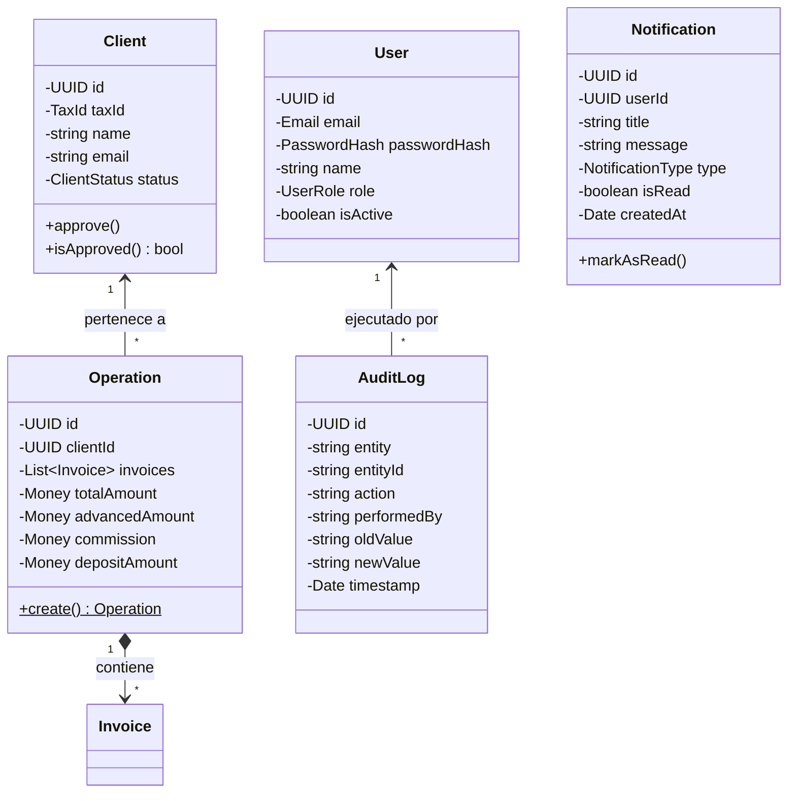

# Architecture - FactorCore 2.0

Este documento detalla la estructura técnica de **FactorCore 2.0**, explicando la interacción entre capas, los límites transaccionales de los Agregados de Dominio y el mapa de servicios.

---

## 🔄 Flujo Arquitectónico

La arquitectura del sistema garantiza un flujo unidireccional estricto de control:

```text
HTTP Controller (NestJS DTOs & ValidationPipes)
       │
       ▼
Application Use Case (TypeScript Puro)
       │
       ▼
Domain Aggregate / Entities (Reglas de Negocio & Invariantes)
       │
       ▼
Domain Repository Port (Interface / Abstracción)
       │
       ▼
Infrastructure Adapter (Prisma Client)
       │
       ▼
Database (PostgreSQL)
```

---

## 🥞 Capas del Sistema (Layers)

* **Domain (`src/domain/`)**: El corazón de la aplicación. Contiene reglas de negocio puras:
  - **Entidades & Agregados**: `Client`, `Operation`, `Invoice`, `User`, `RefreshToken`, `AuditLog`, `Notification`.
  - **Objetos de Valor**: `TaxId`, `Money`, `Percentage`, `InvoiceFolio`, `Email`.
  - **Interfaces de Repositorio**: Puertos para desacoplar la persistencia.
* **Application (`src/application/`)**: Orquesta los Casos de Uso (Use Cases) y define los servicios de aplicación (Hasher, TokenService, QueryServices).
* **Infrastructure (`src/infrastructure/`)**: Implementaciones concretas con Prisma ORM, BCrypt, Passport JWT y mappers de transformación de datos.
* **HTTP (`src/infrastructure/http/`)**: Capa de entrega. Controladores NestJS (`ClientController`, `OperationController`, `AuthController`, `UserController`, `DashboardController`, `AuditController`, `NotificationController`) protegidos con Guards globales (`JwtAuthGuard`, `RolesGuard`).

---

## 🏛️ Modelo Estructural de Agregados



---

## 🔐 Seguridad y Autenticación
- **Control de Acceso Basado en Roles (RBAC)**: Decorador `@Roles(UserRole.ADMINISTRATOR)` para restringir endpoints ejecutivos (`/audit`, `/users`).
- **Cookies HttpOnly**: Refresh Tokens almacenados en cookies seguras para prevenir ataques XSS.
