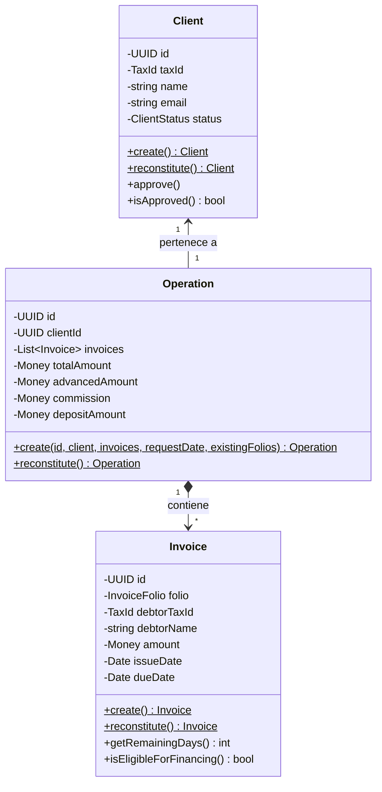

# Architecture

Este documento detalla la estructura técnica de **FactorCore**, explicando cómo interactúan las capas del sistema y justificando las fronteras del modelo de dominio.

---

## 🔄 Flujo Arquitectónico

La arquitectura del sistema garantiza un flujo unidireccional de control, donde las capas externas dependen de las internas, pero nunca al revés.

```text
HTTP Controller (NestJS)
       │
       ▼
Application Use Case (TypeScript Puro)
       │
       ▼
Domain Aggregate / Entities (Reglas de Negocio)
       │
       ▼
Domain Repository Port (Interface)
       │
       ▼
Infrastructure Adapter (Prisma)
       │
       ▼
Database (SQLite)
```

## 🥞 Capas del Sistema (Layers)

*   **Domain (`src/domain/`):** El corazón de la aplicación. Contiene reglas de negocio puras (Agregados, Entidades y Objetos de Valor). No conoce absolutamente nada sobre bases de datos, APIs o frameworks.
*   **Application (`src/application/`):** Orquesta los casos de uso (Use Cases). Recibe peticiones, interactúa con el Dominio y define Puertos (Interfaces) para persistir datos. No contiene lógica de negocio ni decoradores de red.
*   **Infrastructure (`src/infrastructure/`):** Implementa los adaptadores concretos para interactuar con el mundo exterior. Aquí viven los repositorios de Prisma, los Mappers de datos y la conexión a la base de datos.
*   **HTTP (`src/infrastructure/http/`):** La capa de entrega. Recibe requests de red, los valida sintácticamente (DTOs y `class-validator`) y los mapea a comandos que la capa de Aplicación pueda entender.

---

## 3. Modelo Estructural de Agregados



### ❓ ¿Por qué `Invoice` NO es un Aggregate Root?
Una factura, en este contexto de factoraje en lote, nunca existe por sí sola. Siempre es originada como parte de una operación transaccional. Su ciclo de vida depende completamente de la Operación. Permitir que se modifique o consulte una factura fuera de los límites de la Operación pondría en riesgo el cálculo total de aforo y comisión, rompiendo la consistencia del sistema.

### ❓ ¿Por qué `Operation` SÍ es un Aggregate Root?
La Operación actúa como la frontera transaccional. Protege invariantes complejas que involucran al lote completo (ej. verificar que no existan folios duplicados *dentro* del mismo lote). Garantiza que si una sola factura incumple las reglas de negocio (ej. fechas inválidas de 15 a 120 días), ninguna se origina. O se persiste toda la operación de forma atómica, o no se persiste nada.

### Agregado: Client (Aggregate Root)
*   **Responsabilidades:** Mantener identidad fiscal y administrar el estado operativo (`PENDING` / `APPROVED`).
*   **Invariantes:** Un cliente recién registrado no puede originar operaciones hasta ser aprobado.

---

## 4. Decisiones de Diseño y Trade-Offs (ADRs)

### ADR-001: Clean Architecture & Domain-Driven Design (DDD)
*   **Decisión:** Adoptar arquitectura en capas aislando el dominio core (`src/domain/`) a través de Puertos (Interfaces).
*   **Trade-off:** Exige la creación de conversores (Mappers) entre entidades físicas (ORM) y de dominio, incrementando el *boilerplate* inicial a cambio de testabilidad absoluta.

### ADR-002: Aislamiento Estricto de Fronteras
*   **Decisión:** Prohibido importar decoradores (`@Injectable`), librerías de red o modelos ORM dentro de `src/domain/`.
*   **Trade-off:** La validación de entrada HTTP (`class-validator`) se duplica parcialmente dentro de las aserciones internas de los Value Objects, garantizando que el dominio se autovalide sin depender del controlador.

### ADR-003: Persistencia Local (Prisma + SQLite)
*   **Decisión:** Utilizar SQLite + Prisma para evaluación rápida.
*   **Trade-off:** Carece de bloqueos nativos robustos para concurrencia masiva (row-level locks), pero permite a un evaluador instalar y correr el proyecto en 30 segundos sin Docker. En producción, el módulo de base de datos se cambiaría a PostgreSQL.

---

## 5. Jerarquía de Módulos (Inyección de Dependencias)

*   **`DatabaseModule` (`@Global`):** Provee el `PrismaService` como un singleton seguro.
*   **`InfrastructureModule`:** Fábrica que enlaza las interfaces del dominio con sus implementaciones de bases de datos, inyectándolas en las clases puras de `UseCase` para mantener la capa de Aplicación agnóstica de NestJS.
*   **`HttpModule`:** Contiene los Controladores, comunicándose exclusivamente con la capa de Aplicación (Use Cases).
