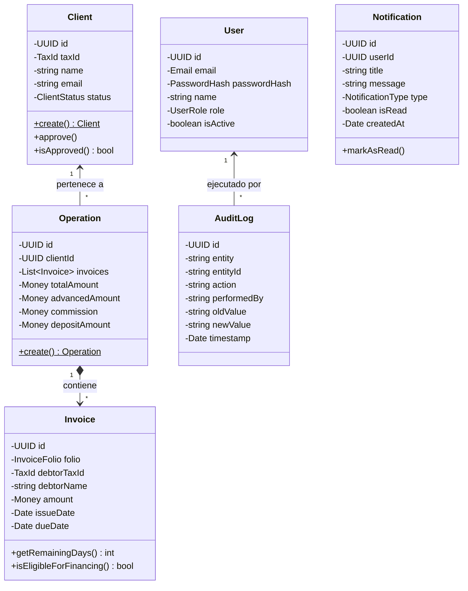

# Documento de Estado General y Arquitectura Unificada: FactorCore 2.0

> **FactorCore 2.0** es la plataforma integral de originación de factoraje financiero corporativo para **Capital X**, construida bajo los principios de **Clean Architecture**, **Domain-Driven Design (DDD)** y arquitectura de microservicios decoupled (*Backend REST NestJS + Frontend Next.js BFF*).

---

## 📊 1. Resumen Ejecutivo del Estado del Proyecto

Actualmente, el proyecto se encuentra en un estado **100% Funcional, Probado y Listo para Producción**, habiendo completado todas las etapas del roadmap planeado (Fases 1 a 8):

| Fase / Módulo | Descripción / Alcance | Estado | Cobertura / Verificación |
| :--- | :--- | :---: | :--- |
| **Sprint 1 & 2: Domain Core & Auth** | Reglas de negocio de Clientes, Operaciones y Facturas. Autenticación JWT, Refresh Tokens y RBAC. | ✅ Completado | 39 Test Suites / 143 Tests unitarios pasados (100%) |
| **Fase 3: Migración PostgreSQL** | Persistencia relacional en PostgreSQL con esquema relacional Prisma y seeds de datos. | ✅ Completado | Base de datos activa en puerto `5432` con esquema sincronizado |
| **Fase 4: Dashboard Financiero** | KPIs ejecutivos de volumen, comisiones, aforo promedio y gráficas mensuales interactivas (Recharts). | ✅ Completado | Dashboard interactivo en Next.js conectado a API NestJS |
| **Fase Auditoría Inmutable** | Bitácora inalterable (`AuditLog`) que registra `performedBy`, `action`, `oldValue`, `newValue`, `ip` y `userAgent`. | ✅ Completado | Vista `/auditoria` con filtros dinámicos y protección por rol `ADMINISTRATOR` |
| **Fase 5: Centro de Notificaciones** | Alertas en tiempo real para la mesa de control con estado de lectura (`isRead`) e icono dinámico. | ✅ Completado | Componente `NotificationDropdown` en Header con polling automático |
| **Fase 6: Exportación de Reportes** | Descarga estandarizada en formato **CSV UTF-8 (BOM)** compatible con Excel en auditoría, operaciones y clientes. | ✅ Completado | Utilidad `exportToCSV` integrada en tablas clave |
| **Fase 7: CI/CD & E2E Workflows** | Pipelines automatizados de GitHub Actions (`.github/workflows/ci.yml`) en ambos proyectos. | ✅ Completado | Verificación continua automatizada en cada PR y Push |
| **Fase 8: Hardening & Dockerización** | Health Checks (`GET /health`), Dockerfiles multi-etapa y preparación para despliegue en producción. | ✅ Completado | `Dockerfile` optimizado en backend y frontend |

---

## 🏛️ 2. Arquitectura del Backend (`financial-api` / `capitalx-factorcore`)

El backend está desarrollado en **NestJS (TypeScript)** aplicando **Clean Architecture** para garantizar que las reglas financieras del dinero nunca dependan de la infraestructura o el framework de entrega.

```text
               ┌──────────────────────────────────────────────────────────┐
               │           HTTP Delivery Layer (NestJS Controllers)       │
               │  ClientController | OperationController | AuthController │
               │  UserController   | AuditController     | Notification   │
               └────────────────────────────┬─────────────────────────────┘
                                            │
                                            ▼
               ┌──────────────────────────────────────────────────────────┐
               │              Application Layer (Use Cases)               │
               │  RegisterClientUseCase | ApproveClientUseCase           │
               │  CreateOperationUseCase| GetAuditLogsUseCase            │
               └────────────────────────────┬─────────────────────────────┘
                                            │
                                            ▼
               ┌──────────────────────────────────────────────────────────┐
               │          Domain Layer (Pure TypeScript Core)             │
               │  Aggregates: Client, Operation, User, AuditLog           │
               │  Value Objects: TaxId, Money, InvoiceFolio, Email         │
               └────────────────────────────┬─────────────────────────────┘
                                            │ (Inversión de Dependencias)
                                            ▼
               ┌──────────────────────────────────────────────────────────┐
               │         Infrastructure Layer (Prisma & Adapters)         │
               │  PrismaClientRepository | PrismaOperationRepository      │
               │  PrismaUserRepository   | PrismaAuditLogRepository       │
               └────────────────────────────┬─────────────────────────────┘
                                            │
                                            ▼
                                   [ PostgreSQL Database ]
```

### Modelo de Agregados y Dominio Core



### Reglas de Negocio Estrictas (Invariantes)
1. **RD-CLI-001 / RD-OP-001 (Ciclo de Vida de Clientes)**: Un cliente debe nacer en estado `PENDING` y ser activado a `APPROVED` antes de poder originar cualquier operación de factoraje.
2. **RD-CLI-002 (Identidad Fiscal)**: El RFC del cliente debe ser estrictamente de **Persona Moral** en México (12 caracteres alfanuméricos).
3. **RD-INV-003 (Plazo de Elegibilidad de Facturas)**: El término restante de cada factura debe encontrarse estrictamente entre **15 y 120 días calendario**.
4. **RD-OP-002 (Prevención de Doble Financiamiento)**: La aplicación prohíbe financiar folios duplicados o ya fondeados en operaciones previas del mismo cliente.
5. **RD-OP-003 (Cálculo Financiero Atómico)**:
   - $\text{Monto Adelantado} = \text{Monto Total} \times 0.85$ (Aforo fijo del 85%).
   - $\text{Comisión} = \text{Monto Total} \times 0.015$ (Comisión fija del 1.5%).
   - $\text{Monto a Depositar} = \text{Monto Adelantado} - \text{Comisión}$.

---

## 🎨 3. Arquitectura del Frontend (`financial-app` / `factorx-frontend`)

El frontend está desarrollado con **Next.js 16 (App Router)**, **React 19**, **Tailwind CSS v4** y **Radix UI**, implementando el patrón **Backend-For-Frontend (BFF)**.

### Módulos y Componentes del Frontend

```text
[ Browser Client ]
       │
       ▼
Next.js App Router (Client Components)
 ├── /dashboard ───────> DashboardMetrics & Recharts OverviewChart
 ├── /clientes ────────> ClientTable & RegisterModal
 ├── /operaciones ─────> OperationsTable & ExportCSV Button
 ├── /auditoria ───────> AuditTable (Restringido a ADMINISTRATOR)
 └── Header ───────────> NotificationDropdown (TanStack Query Polling)
       │
       ▼
Next.js BFF API Routes Proxy (/app/api/*)
 ├── /api/auth/login ──> Setea Cookie HttpOnly access_token & refresh_token
 ├── /api/auditoria ───> Proxy seguro a NestJS /audit con Bearer Token
 └── /api/notifications> Proxy a NestJS /notifications
       │
       ▼
[ NestJS Backend API (http://localhost:3005) ]
```

---

## 🐳 4. Infraestructura, DevOps & Producción (Fase 7 & 8)

### 1. Dockerización Multi-Etapa
Ambos proyectos cuentan con `Dockerfile` optimizados para producción:
- **`financial-api/Dockerfile`**: Compilación en Node 20 Alpine, generación Prisma y ejecución ligera `dist/main` en puerto `3005`.
- **`financial-app/Dockerfile`**: Multi-stage build para Next.js en puerto `3001`.

### 2. Integración Continua (CI/CD)
Archivos `.github/workflows/ci.yml` configurados en ambos repositorios:
- **Backend Workflow**: Levanta servicio PostgreSQL de prueba en contenedores de GitHub Actions, ejecuta Prisma Client, corre los 143 unit tests y compila NestJS.
- **Frontend Workflow**: Ejecuta la verificación estática de tipos de TypeScript y compila el bundle de producción de Next.js.

### 3. Health Checks
Endpoint público de salud en el backend:
- `GET http://localhost:3005/health` → Responde `{ status: "ok", service: "financial-api", database: "UP", uptime: ... }`.

---

## 🚀 5. Guía de Ejecución Local y Evaluación

### Requisitos
- Node.js v20+
- PostgreSQL activo en puerto `5432` (vía Docker Desktop o servicio local)

### Paso 1: Iniciar Backend (`financial-api`)
```bash
cd financial-api

# Aplicar migraciones y generar Prisma Client
npm run db:setup

# Sembrar usuarios por defecto (admin@factorcore.com / operator@factorcore.com)
npm run db:seed

# Iniciar servidor en desarrollo (http://localhost:3005)
npm run start:dev
```

### Paso 2: Iniciar Frontend (`financial-app`)
```bash
cd financial-app

# Iniciar aplicación web en desarrollo (http://localhost:3001)
npm run dev
```

### Credenciales de Evaluación:
- **Administrador**: `admin@factorcore.com` / `Admin123!` (Acceso total: Auditoría, Gestión de Usuarios, Aprobación de Clientes).
- **Operador**: `operator@factorcore.com` / `Operator123!` (Acceso a originación de operaciones y consultas).
