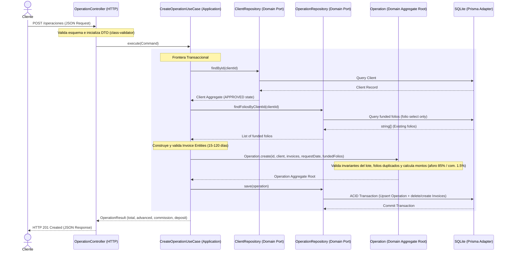

# FactorCore

Durante el desarrollo se priorizó el diseño del dominio y la documentación de decisiones técnicas antes de iniciar la implementación. El objetivo fue construir una solución mantenible, fácilmente extensible y con reglas de negocio claramente aisladas de la infraestructura.

> *"The business rules drive the design. Frameworks, databases, and libraries are implementation details."*

---

## Project Status

*   ✅ **Domain Modeling** (Lenguaje ubicuo, glosario y modelado de agregados)
*   ✅ **Business Rules** (Cálculo de aforo del 85%, comisión del 1.5% e invariantes de fecha 15-120 días)
*   ✅ **Architecture** (ADR-001 al ADR-003, modelo de dominio y segregación en capas)
*   ✅ **Infrastructure** (Adapters de persistencia concretos de Prisma + SQLite y mapeadores explícitos)
*   ✅ **Dependency Injection** (Módulos de NestJS desacoplados mediante proveedores fábrica)
*   ✅ **HTTP Layer** (Controladores de clientes y operaciones, DTOs validados con class-validator)
*   ✅ **Exception Handling** (Filtro global de excepciones con mapeos de errores de negocio a HTTP)
*   ✅ **Swagger Docs** (OpenAPI interactivo documentando todos los endpoints en `/api`)
*   ✅ **Integration Tests** (Suites unitarias y de integración de extremo a extremo con SQLite de prueba)

---

## Flujo de Datos E2E (`POST /operaciones`)

El siguiente diagrama ilustra el flujo de control, validaciones y persistencia transaccional del sistema al originar una operación financiera:



---

## Estructura del Proyecto

*   **[PROJECT_GUIDE.md](PROJECT_GUIDE.md):** La guía principal y única fuente de verdad técnica y de negocio del proyecto. Contiene la visión del producto, glosario, reglas detalladas e historial de decisiones de diseño.
*   **[docs/](docs/):** Documentación técnica de soporte:
    *   **[architecture/](docs/architecture/):** ADRs (Registros de Decisiones de Arquitectura) y el [modelo de dominio](docs/architecture/domain-model.md).
    *   **[development/](docs/development/):** Diario de ingeniería ([engineering-journal.md](docs/development/engineering-journal.md)) y roadmap del proyecto.
*   **`src/`:** Código fuente estructurado bajo Clean Architecture:
    *   `src/domain/`: Entidades, Agregados, Value Objects y puertos de repositorios sin dependencias externas.
    *   `src/application/`: Casos de uso de negocio puros, independientes del framework.
    *   `src/infrastructure/`: Adapters concretos de persistencia (Prisma), DTOs, controladores NestJS y filtros de excepción global.

---

## Guía de Instalación y Ejecución

### 1. Requisitos
*   Node.js (versión >= 20)
*   npm

### 2. Configuración e Inicialización Rápida
Clona el repositorio, instala dependencias e inicializa la base de datos de manera automatizada:
```bash
# Copia la plantilla de configuración de variables de entorno
cp .env.example .env

# Instala todas las dependencias
npm install

# Inicializa la base de datos SQLite y genera el cliente Prisma
npm run db:setup
```

### 3. Ejecución de Pruebas
El proyecto tiene un alto estándar de calidad con cobertura en todas las capas:
```bash
# Ejecutar todas las pruebas unitarias (Dominio, Casos de uso, Mapeadores)
npm run test

# Ejecutar las pruebas de integración de extremo a extremo (E2E) contra base de datos aislada
npm run test:e2e
```

### 4. Iniciar el Servidor
```bash
# Iniciar la aplicación NestJS en modo desarrollo (Puerto 3000 por defecto)
npm run start:dev
```

### 5. Documentación Interactiva de la API (Swagger)
Con el servidor encendido, puedes acceder a la interfaz interactiva de Swagger y probar los endpoints directamente en:
👉 [http://localhost:3000/api](http://localhost:3000/api)

---

## Endpoints Disponibles e Interacción

### 1. `POST /clientes` (Registro de cliente)
Crea una empresa proveedora. Inicia en estado `PENDING`.
*   **Request Example:**
    ```json
    {
      "id": "123e4567-e89b-42d3-8456-426614174000",
      "rfc": "XYZ850101XXX",
      "name": "Consorcio Industrial S.A.",
      "email": "contacto@consorcio.mx"
    }
    ```

### 2. `PATCH /clientes/{id}/aprobar` (Aprobación de cliente)
Autoriza al cliente para poder realizar operaciones de factoraje.
*   **URL Parameter:** `id` (UUID v4)
*   **Response:** HTTP `200 OK`

### 3. `POST /operaciones` (Originación de operación)
Envía un lote de facturas para financiamiento. Realiza todas las validaciones e invariantes de negocio de manera atómica.
*   **Request Example:**
    ```json
    {
      "operationId": "923e4567-e89b-42d3-8456-426614174000",
      "clientId": "123e4567-e89b-42d3-8456-426614174000",
      "requestDate": "2026-07-10T12:00:00Z",
      "invoices": [
        {
          "id": "223e4567-e89b-12d3-a456-426614174001",
          "folio": "FOL-100",
          "debtorRfc": "DEF020202ABC",
          "debtorName": "Distribuidora del Norte S.A.",
          "amount": 10000.0,
          "issueDate": "2026-07-01T00:00:00Z",
          "dueDate": "2026-08-15T00:00:00Z"
        }
      ]
    }
    ```
*   **Response Example (201 Created):**
    ```json
    {
      "operationId": "923e4567-e89b-42d3-8456-426614174000",
      "totalAmount": 10000.0,
      "advancedAmount": 8500.0,
      "commission": 150.0,
      "depositAmount": 8350.0
    }
    ```

### 4. `GET /clientes/{id}/resumen` (Resumen métrico de cliente)
Obtiene el consolidado ejecutivo de la actividad financiera del cliente.
*   **Response Example (200 OK):**
    ```json
    {
      "operationCount": 1,
      "totalAdvancedAmount": 8500.0,
      "nearestDueDate": "2026-08-15T00:00:00Z"
    }
    ```
