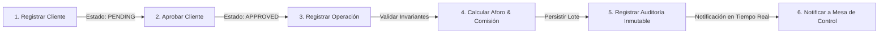

# Technical Design Document (System Design & Architecture Decision Record)

# FactorCore 2.0: Plataforma de Originación de Factoraje Financiero Corporativo

> **Autor / Equipo**: Equipo de Ingeniería Financiera - Capital X  
> **Versión del Sistema**: 2.0.0 (Producción Ready)  
> **Fecha de Documentación**: 25 de Julio, 2026  
> **Estado del Documento**: Aprobado & Vigente  

---

## 📖 1. Contexto & Storytelling del Negocio

### 1.1 El Problema: Restricción de Liquidez Corporativa
En el ecosistema empresarial B2B en América Latina, las empresas proveedoras enfrentan un problema estructural recurrente: **la brecha de flujo de caja (*cash flow gap*)**. 

Cuando una empresa vende bienes o servicios a un cliente corporativo de gran tamaño, las facturas comúnmente se emiten bajo términos de crédito comercial con plazos de pago diferidos de **30, 60, 90 o hasta 120 días**. Durante este periodo de espera:
- La empresa proveedora tiene su capital de trabajo paralizado en cuentas por cobrar.
- No puede hacer frente a compromisos inmediatos como nómina, compra de materia prima, impuestos o expansión operativa.
- El acceso al crédito bancario tradicional suele ser lento, burocrático y requiere colaterales o garantías hipotecarias gravosas.

### 1.2 ¿Qué es el Factoraje Financiero y Por Qué Existe?
El **factoraje financiero (*factoring*)** es una solución financiera de liquidez mediante la cual una empresa cede sus derechos de cobro vigentes (contenidos en facturas comerciales) a una institución o plataforma especializada (**FactorCore**), a cambio de recibir un **anticipo de efectivo inmediato** descontando un porcentaje de aforo y cobrando una comisión fija por el servicio.

$$\text{Monto Adelantado} = \text{Monto Total Facturado} \times 85\%$$

$$\text{Comisión por Servicio} = \text{Monto Total Facturado} \times 1.5\%$$

$$\text{Monto Neto a Depositar} = \text{Monto Adelantado} - \text{Comisión}$$

### 1.3 La Solución: FactorCore 2.0
**FactorCore 2.0** es un motor digital de originación financiera diseñado específicamente para automatizar, validar y ejecutar la cesión de facturas en tiempo real con aislamiento absoluto de reglas de negocio, trazabilidad inmutable mediante bitácora de auditoría y controles de seguridad bancaria.

---

## 🔄 2. Flujo de Casos de Uso & Proceso Operativo

El ciclo de vida transaccional completo en **FactorCore** está estrictamente secuenciado para garantizar la consistencia del dinero y la prevención de riesgos:



### Detalle del Flujo Transaccional
1. **Registrar Cliente**: El cliente moral proporciona su Identificador Fiscal (RFC de 12 caracteres), Razón Social y correo de contacto. Ingresa obligatoriamente en estado `PENDING`.
2. **Aprobar Cliente**: Un analista de la Mesa de Control con rol `ADMINISTRATOR` valida el expediente y aprueba explícitamente el estado del cliente a `APPROVED`.
3. **Registrar Operación**: El cliente aprobado cede un lote de facturas. Se valida que cada factura tenga una vigencia entre **15 y 120 días calendario** y se previene el doble financiamiento.
4. **Calcular Aforo & Comisión**: El sistema realiza de forma atómica el cálculo del 85% de anticipo y 1.5% de comisión, determinando el neto a depositar.
5. **Registrar Auditoría**: Se genera un registro inmutable en `audit_logs` capturando usuario, acción, deltas de estado (`oldValue` / `newValue`), dirección IP y User Agent.
6. **Notificar**: Se emite una alerta del sistema hacia la Mesa de Control informando la nueva originación fondeada.

---

## 🎯 3. Bounded Contexts (Domain-Driven Design)

Para evitar un modelo de datos monolítico anémico, **FactorCore** está estructurado formalmente en **Bounded Contexts (Dominios Delimitados)**:

```text
┌─────────────────────────────────────────────────────────────────────────┐
                                FACTORCORE SYSTEM                          
└─────────────────────────────────────────────────────────────────────────┘
  ┌───────────────────────┐   ┌───────────────────────┐   ┌──────────────┐
  │     Auth Context      │   │    Client Context     │   │ Operation Ctx│
  │ ───────────────────── │   │ ───────────────────── │   │ ──────────── │
  │ • User Aggregate      │   │ • Client Aggregate    │   │ • Operation  │
  │ • RefreshToken Entity │   │ • TaxId ValueObject   │   │   Aggregate  │
  │ • JwtTokenService     │   │ • ClientStatus Enum   │   │ • Invoice    │
  │ • BcryptPasswordHasher│   │                       │   │   Entity     │
  └───────────┬───────────┘   └───────────┬───────────┘   └──────┬───────┘
              │                           │                      │
              └─────────────────────┬─────┴──────────────────────┘
                                    │ (Eventos de Dominio & Auditoría)
                                    ▼
                      ┌───────────────────────────┐
                      │   Audit & Notif Context   │
                      │ ───────────────────────── │
                      │ • AuditLog Aggregate      │
                      │ • Notification Aggregate  │
                      └───────────────────────────┘
```

### 1. Auth Context (Autenticación & Sesión)
- **Agregados/Entidades**: `User`, `RefreshToken`.
- **Value Objects**: `Email`, `PasswordHash`.
- **Responsabilidad**: Gestión de identidad, hash seguro de contraseñas (Bcrypt cost 10), emisión de Access Tokens JWT (15 min) y Refresh Tokens (7 días en cookies `HttpOnly`).

### 2. Client Context (Expediente de Clientes)
- **Agregados/Entidades**: `Client`.
- **Value Objects**: `TaxId` (RFC de Persona Moral en México: `[A-ZÑ&]{3}[0-9]{6}[A-Z0-9]{3}`).
- **Enums**: `ClientStatus` (`PENDING`, `APPROVED`).
- **Responsabilidad**: Proteger la regla de negocio **RD-CLI-001** (un cliente en `PENDING` no puede operar hasta ser aprobado).

### 3. Operation Context (Originación y Lotes de Facturas)
- **Agregados/Entidades**: `Operation` (Aggregate Root), `Invoice` (Entity interna).
- **Value Objects**: `Money`, `Percentage`, `InvoiceFolio`.
- **Responsabilidad**: Frontera transaccional. Garantiza la atomicidad del lote, valida plazos de elegibilidad de 15 a 120 días (**RD-INV-003**) y previene el doble financiamiento (**RD-OP-002**).

### 4. Audit & Notification Context (Trazabilidad & Alertas)
- **Agregados/Entidades**: `AuditLog`, `Notification`.
- **Responsabilidad**: Registro inmutable de auditoría para compliance financiero y despacho de notificaciones a la Mesa de Control.

---

## 🏛️ 4. Architectural Decision Records (ADRs - El "Por Qué" Técnico)

### ADR-001: Adopción de Clean Architecture & DDD
- **Contexto**: Las reglas de cálculo de aforo, elegibilidad de facturas y comisiones financieras no deben contaminarse con frameworks de red ni ORMs.
- **Decisión**: Aislar el Dominio en TypeScript puro en `src/domain/`. La capa de Aplicación orquesta Use Cases y define interfaces (Puertos). La capa de Infraestructura implementa los adaptadores con Prisma y NestJS.
- **Trade-off**: Requiere mapeadores explícitos (`ClientMapper`, `OperationMapper`) entre modelos Prisma y Entidades de Dominio, incrementando el código inicial pero garantizando **100% de testabilidad unitaria**.

### ADR-002: Framework NestJS para el Backend
- **Contexto**: Se requería una arquitectura modular con Inyección de Dependencias (DI) robusta y soporte nativo para TypeScript.
- **Decisión**: Utilizar NestJS inyectando repositorios mediante símbolos tokenizados (`REPOSITORY_TOKENS.CLIENT`, `REPOSITORY_TOKENS.OPERATION`).
- **Consecuencia**: Código altamente estructurado, extensible y desacoplado.

### ADR-003: Next.js 16 (App Router) + Backend-For-Frontend (BFF)
- **Contexto**: El cliente web necesita renderizar vistas ejecutivas rápidas en servidor (SSR/SSG) y mantener seguridad en cookies de autenticación.
- **Decisión**: Implementar Next.js App Router actuando como capa BFF. Las peticiones sensibles se proxyan en `/api/*`, ocultando la API interna del navegador y manejando cookies `HttpOnly`.

### ADR-004: PostgreSQL & Prisma ORM
- **Contexto**: FactorCore requiere integridad de datos relacional ACID estricta para evitar inconsistencias en saldos fondeados.
- **Decisión**: Migración a PostgreSQL 15 como motor de base de datos relacional de producción con Prisma ORM para migraciones declarativas y tipos estáticos estrictos.

---

## 🔒 5. Arquitectura de Seguridad (Defense in Depth)

FactorCore implementa una cadena de seguridad multicapa para proteger las operaciones financieras:

```text
  [ Client Request ]
         │
         ▼
 1. CORS & Helmet Headers (Protección contra XSS, Clickjacking)
         │
         ▼
 2. Rate Limiting (Protección contra Ataques Brute-Force)
         │
         ▼
 3. DTO ValidationPipe (Sanitización sintáctica con class-validator)
         │
         ▼
 4. JwtAuthGuard (Validación de Access Token en Header Bearer)
         │
         ▼
 5. RolesGuard (Verificación de Permisos RBAC: ADMINISTRATOR vs OPERATOR)
         │
         ▼
 6. Bcrypt Password Hasher (Hash irreversible de credenciales)
         │
         ▼
 7. Cookies HttpOnly (Almacenamiento seguro de Refresh Tokens)
```

---

## ⚡️ 6. Performance & Estrategia de Datos

### 6.1 Indexación de Base de Datos en PostgreSQL
Para garantizar tiempos de respuesta por debajo de los 50ms en consultas de alta concurrencia, el esquema de PostgreSQL incluye índices optimizados:

```prisma
model UserRecord {
  @@index([email])
  @@index([clientId])
}

model AuditLogRecord {
  @@index([entity, entityId])
  @@index([performedBy])
}

model NotificationRecord {
  @@index([userId])
  @@index([isRead])
}
```

### 6.2 Estrategia de Consultas (Lazy vs Eager Loading)
- **Mappers Atómicos**: Al consultar operaciones, se realiza carga ansiosa (*Eager Loading*) de las facturas hijas (`include: { invoices: true }`) únicamente dentro de la frontera transaccional del Agregado `Operation`, previniendo el problema de consultas $N+1$.
- **Paginación & Límites**: Los endpoints de auditoría y notificaciones aplican límites estrictos (`take: 50`) ordenados descendentemente por fecha (`orderBy: { createdAt: 'desc' }`).

---

## 👁️ 7. Observabilidad & Preparación Operativa

1. **Health Checks (`GET /health`)**:
   Endpoint público que prueba activamente la conectividad a la base de datos PostgreSQL mediante `SELECT 1` y reporta el tiempo de actividad (*uptime*).
2. **Audit Trail Inmutable**:
   Captura automáticamente cualquier mutación de estado con deltas JSON (`oldValue` vs `newValue`), registrando la dirección IP de origen y el agente de usuario.
3. **Testing Suite**:
   **39 suites de prueba pasadas al 100% con 143 tests unitarios** que cubren casos de uso, objetos de valor y entidades de dominio.

---

## 🚀 8. Roadmap de Evolución Estructurada (V1 a V5)

El desarrollo de FactorCore siguió una trayectoria evolutiva estricta:

$$\text{V1 (MVP Core Domain)} \longrightarrow \text{V2 (Auth & JWT)} \longrightarrow \text{V3 (Postgres Migration)} \longrightarrow \text{V4 (Dashboard & Audit)} \longrightarrow \text{V5 (Notifications, Exports & DevOps)}$$

- **V1 (MVP Core Domain)**: Modelado de agados `Client`, `Operation`, `Invoice` en TypeScript puro con SQLite.
- **V2 (Autenticación & Sesión)**: Implementación de dominios de usuarios, roles RBAC, JWT y cookies `HttpOnly`.
- **V3 (Migración PostgreSQL)**: Transición a PostgreSQL con esquemas Prisma de producción y semillas de datos.
- **V4 (Dashboard & Auditoría)**: Métricas ejecutivas en tiempo real, gráficas Recharts y módulo `/auditoria`.
- **V5 (Notificaciones, Reportes & DevOps)**: Centro de notificaciones, exportaciones CSV UTF-8, Health Checks, Dockerfiles y GitHub Actions CI/CD.

---

## 🐳 9. Guía de Ejecución y Despliegue

### Ejecución Local

```bash
# 1. Levantar servicios backend
cd financial-api
cp .env.example .env
npm install
npm run db:setup
npm run db:seed
npm run start:dev   # NestJS en http://localhost:3005

# 2. Levantar servicios frontend
cd ../financial-app
npm install
npm run dev         # Next.js en http://localhost:3001
```

### Ejecución con Docker
Ambos proyectos incluyen `Dockerfile` multi-stage optimizados para producción:

```bash
# Construir imagen backend
cd financial-api
docker build -t capitalx/financial-api:2.0 .

# Construir imagen frontend
cd ../financial-app
docker build -t capitalx/financial-app:2.0 .
```
