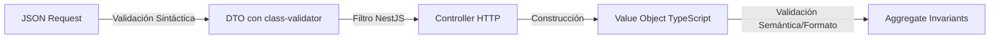
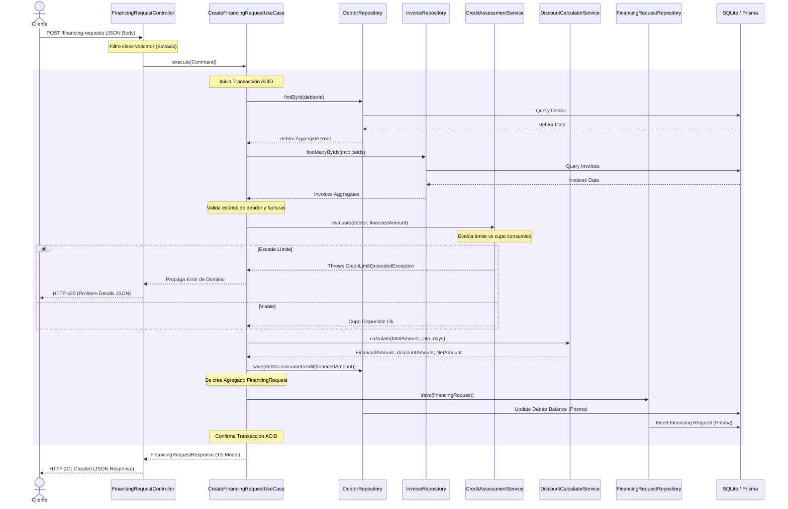

# Sesión de Diseño de Arquitectura Técnica (Pre-Implementación)

Este documento detalla la estructura física, contratos de clases, firmas de métodos y el flujo de control de datos del sistema **FactorCore** previo al inicio de la fase de programación.

---

## 1. Estructura Física Detallada de `src/`

```text
src/
├── domain/                               # Lógica de Negocio Pura (TS Nativo)
│   ├── common/                           # Utilidades y clases base de DDD
│   │   ├── value-objects/
│   │   │   ├── money.value-object.ts
│   │   │   ├── percentage.value-object.ts
│   │   │   └── tax-id.value-object.ts
│   │   ├── entities/
│   │   │   └── entity.base.ts
│   │   └── exceptions/
│   │       └── domain.exception.ts
│   ├── debtor/                           # Agregado de Deudor
│   │   ├── debtor.aggregate.ts
│   │   ├── debtor-status.enum.ts
│   │   └── debtor.repository.ts          # Puerto (Interface)
│   ├── invoice/                          # Agregado de Factura
│   │   ├── invoice.aggregate.ts
│   │   ├── invoice-status.enum.ts
│   │   ├── invoice-folio.value-object.ts
│   │   └── invoice.repository.ts         # Puerto (Interface)
│   ├── financing/                        # Agregado de Solicitudes de Financiamiento
│   │   ├── financing-request.aggregate.ts
│   │   ├── financing-request-status.enum.ts
│   │   └── financing-request.repository.ts # Puerto (Interface)
│   ├── issuer/                           # Agregado de Emisor (Cliente Plataforma)
│   │   ├── issuer.aggregate.ts
│   │   ├── issuer-status.enum.ts
│   │   └── issuer.repository.ts          # Puerto (Interface)
│   └── services/                         # Servicios de Dominio
│       ├── discount-calculator.service.ts
│       └── credit-assessment.service.ts
│
├── application/                          # Casos de Uso del Negocio
│   ├── common/
│   │   └── use-case.interface.ts         # Contrato general de Caso de Uso
│   ├── debtor/
│   │   ├── commands/
│   │   │   └── register-debtor.command.ts
│   │   └── use-cases/
│   │       └── register-debtor.use-case.ts
│   ├── invoice/
│   │   ├── commands/
│   │   │   └── register-invoice.command.ts
│   │   └── use-cases/
│   │       └── register-invoice.use-case.ts
│   └── financing/
│       ├── commands/
│       │   └── create-financing-request.command.ts
│       └── use-cases/
│           ├── create-financing-request.use-case.ts
│           └── approve-financing-request.use-case.ts
│
├── interface/                            # Capa de Adaptadores de Interfaz
│   ├── controllers/                      # Controladores HTTP de NestJS
│   │   ├── debtor.controller.ts
│   │   ├── invoice.controller.ts
│   │   └── financing-request.controller.ts
│   ├── dtos/                             # DTOs de Entrada/Salida (class-validator)
│   │   ├── debtor/
│   │   │   └── register-debtor.dto.ts
│   │   ├── invoice/
│   │   │   └── register-invoice.dto.ts
│   │   └── financing/
│   │       ├── create-financing-request.dto.ts
│   │       └── financing-request-response.dto.ts
│   └── mappers/                          # Convertidores API <-> Dominio <-> DB
│       ├── debtor.mapper.ts
│       ├── invoice.mapper.ts
│       └── financing-request.mapper.ts
│
└── infrastructure/                       # Detalles Concretos (Framework e Infra)
    ├── database/                         # Persistencia y esquema ORM
    │   ├── prisma/
    │   │   ├── schema.prisma             # Modelado físico relacional
    │   │   └── prisma.service.ts
    │   └── repositories/                 # Implementaciones de Repositorios (Adaptadores)
    │       ├── prisma-debtor.repository.ts
    │       ├── prisma-invoice.repository.ts
    │       └── prisma-financing-request.repository.ts
    └── framework/                        # Inicialización de NestJS
        ├── modules/                      # Módulos de orquestación
        │   ├── app.module.ts
        │   ├── database.module.ts
        │   ├── debtor.module.ts
        │   ├── invoice.module.ts
        │   └── financing.module.ts
        ├── filters/                      # Filtro de excepción global
        │   └── http-exception.filter.ts
        └── main.ts                       # Entrada NestJS
```

---

## 2. Definición de Módulos Físicos (NestJS)

*   **`DatabaseModule`:** Inicializa el cliente global de Prisma y exporta las implementaciones de los repositorios (`PrismaDebtorRepository`, `PrismaInvoiceRepository`, `PrismaFinancingRequestRepository`) asociados a sus respectivas interfaces (tokens de inyección).
*   **`DebtorModule`:** Encapsula el `DebtorController`, los casos de uso correspondientes (`RegisterDebtorUseCase`) y sus adaptadores. Depende de `DatabaseModule`.
*   **`InvoiceModule`:** Encapsula el `InvoiceController`, el caso de uso `RegisterInvoiceUseCase`. Depende de `DatabaseModule`.
*   **`FinancingModule`:** Coordina la creación y aprobación de solicitudes de financiamiento. Contiene `FinancingRequestController` y los Use Cases. Depende de todos los módulos anteriores para consultar datos cruzados.

---

## 3. Firmas de Métodos de Repositorios (Puertos)

### `DebtorRepository`
```typescript
interface DebtorRepository {
  findById(id: string): Promise<Debtor | null>;
  findByTaxId(taxId: string): Promise<Debtor | null>;
  save(debtor: Debtor): Promise<void>;
}
```

### `InvoiceRepository`
```typescript
interface InvoiceRepository {
  findById(id: string): Promise<Invoice | null>;
  findManyByIds(ids: string[]): Promise<Invoice[]>;
  findByFolioAndIssuer(folio: string, issuerId: string): Promise<Invoice | null>;
  save(invoice: Invoice): Promise<void>;
}
```

### `FinancingRequestRepository`
```typescript
interface FinancingRequestRepository {
  findById(id: string): Promise<FinancingRequest | null>;
  save(request: FinancingRequest): Promise<void>;
}
```

---

## 4. Clasificación de Excepciones del Dominio

Todas las excepciones del dominio heredan de `DomainException` y son lanzadas por los agregados o servicios de dominio cuando se intenta violar una regla de negocio:

| Excepción de Dominio | Código HTTP de Retorno | Descripción |
| :--- | :--- | :--- |
| `CreditLimitExceededException` | `422 Unprocessable Entity` | El saldo de financiamiento vigente excede la línea aprobada del deudor. |
| `DuplicateInvoiceException` | `409 Conflict` | Ya existe una factura registrada con el mismo folio y emisor en el sistema. |
| `InvalidInvoiceDueDateException` | `400 Bad Request` | La fecha de vencimiento es inferior a 15 días a partir del día de solicitud. |
| `DebtorSuspendedException` | `422 Unprocessable Entity` | El deudor no está activo o se encuentra suspendido. |
| `EntityNotFoundException` | `404 Not Found` | No se encuentra el Emisor, Deudor o Factura especificado. |

---

## 5. Estrategia de Validación de Datos



1.  **Validación Sintáctica (Frontera):** Se realiza en la capa de adaptadores (DTO) utilizando los decoradores `@IsString()`, `@IsUUID()`, `@IsNotEmpty()`, `@IsNumber()` de `class-validator` y `class-transformer`. Si el JSON de entrada es incorrecto, el `ValidationPipe` aborta y devuelve `400 Bad Request`.
2.  **Validación Semántica y de Formato (Dominio):** Se realiza dentro de los constructores de los **Value Objects** (`TaxId`, `Money`, `Percentage`). Si el formato no coincide (ej. RFC inválido, porcentaje menor a 0 o mayor a 100, dinero negativo), se arroja una excepción de dominio directamente, impidiendo la construcción de un objeto en estado inconsistente.

---

## 6. Flujo de Control Completo: `POST /financing-requests`

El flujo coordinado de control y persistencia se describe a continuación:


