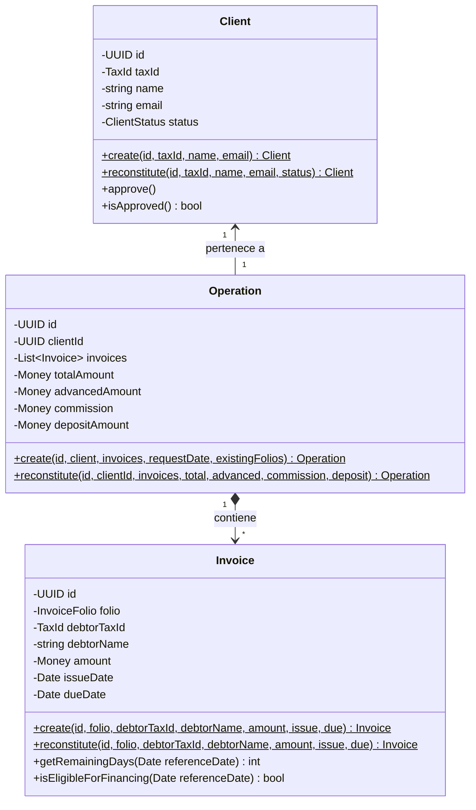

# Modelado de Dominio: FactorCore

Este documento detalla el Lenguaje Ubicuo, Agregados, Entidades y Objetos de Valor que constituyen el núcleo del negocio financiero en **FactorCore**.

---

## 1. Lenguaje Ubicuo

*   **Cliente (Client):** Empresa proveedora registrada en la plataforma que cede sus facturas (cuentas por cobrar) para recibir capital anticipado.
*   **Operación (Operation):** Transacción financiera que agrupa un lote de facturas cedidas por un cliente aprobado.
*   **Factura (Invoice):** Documento comercial individual que representa un derecho de cobro a un Deudor. Es una entidad hija dentro del agregado de la Operación.
*   **Deudor (Debtor):** Empresa obligada a pagar la factura a su vencimiento. En esta versión simplificada del dominio, el Deudor se identifica por su RFC y Razón Social dentro de cada Factura.
*   **Aforo (Advance Rate):** Porcentaje del valor total de la factura que se adelanta al cliente (fijado en 85%).
*   **Comisión (Factoring Fee):** Comisión cobrada por la plataforma por procesar el anticipo (fijada en 1.5% del valor nominal de la factura).
*   **Monto a Depositar (Net Disbursed Amount):** Dinero neto transferido al cliente, equivalente a `Monto Adelantado - Comisión`.

---

## 2. Objetos de Valor (Value Objects)

Son objetos inmutables que se auto-validan en su constructor. Si los datos provistos son inválidos, lanzan un `DomainException` e impiden que se cree un estado inconsistente en el sistema:

*   **`Money`:** Representa cantidades monetarias. Redondea matemáticamente a 2 decimales y prohíbe montos negativos.
*   **`TaxId`:** Encapsula el RFC moral mexicano (12 caracteres). Normaliza a mayúsculas y quita espacios/guiones al instanciarse.
*   **`InvoiceFolio`:** Encapsula el folio de la factura limpiando espacios adicionales en sus extremos.

---

## 3. Modelo Estructural de Agregados

### Agregado: Client (Aggregate Root)
*   **Responsabilidades:**
    *   Mantener la identidad fiscal y datos de contacto de la empresa proveedora.
    *   Administrar su estado operativo en la plataforma (`PENDING` o `APPROVED`).
*   **Invariantes:**
    *   Todo cliente nuevo se registra obligatoriamente en estado `PENDING`.
    *   Un cliente aprobado no puede ser aprobado nuevamente.

### Agregado: Operation (Aggregate Root)
*   **Responsabilidades:**
    *   Agrupar y poseer las facturas cedidas.
    *   Validar la viabilidad de la originación (que el cliente sea apto y que no existan folios duplicados).
    *   Efectuar los cálculos del aforo (85%), la comisión (1.5%) y el depósito neto.
*   **Invariantes:**
    *   No puede existir una operación vacía (debe tener al menos una factura).
    *   El cliente asociado debe estar en estado `APPROVED`.
    *   Todas las facturas hijas de la operación deben superar individualmente sus validaciones internas de fechas, montos y vigencia.
    *   Ningún folio de factura puede estar duplicado dentro de la operación, ni coincidir con folios financiados en operaciones previas del mismo cliente.

### Entidad Hija: Invoice
*   **Responsabilidades:**
    *   Encapsular el deudor, monto y fechas de vencimiento de la cuenta por cobrar.
*   **Invariantes:**
    *   La fecha de vencimiento debe ser posterior a la fecha de emisión.
    *   Para ser financiada, el término restante desde la fecha de solicitud debe estar comprendido **estrictamente entre 15 y 120 días calendario**.
