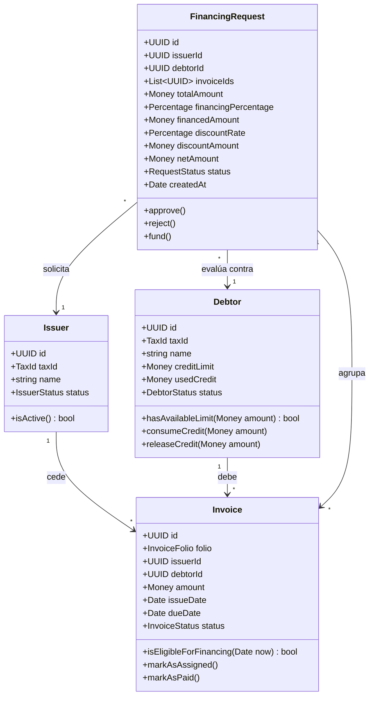

# Domain Model

This document outlines the Ubiquitous Language, Aggregate Roots, Entities, Value Objects, and invariants that form the core business logic of **FactorCore**.

---

## 1. Ubiquitous Language

*   **Emisor (Issuer):** Customer platform company ceding its accounts receivable (invoices) to obtain immediate liquidity.
*   **Deudor (Debtor):** Entity legally obligated to pay the invoices at their maturity date.
*   **Factura (Invoice):** Accounts receivable document acting as collateral for the transaction.
*   **Solicitud de Financiamiento (Financing Request):** Transaction grouping invoices from a debtor to advance funds to the issuer.
*   **Línea de Crédito (Credit Line):** Approved credit limit assigned to a debtor, limiting total outstanding exposure.
*   **Monto Neto (Net Amount):** Final liquid payout disbursed to the issuer after subtracting discount interest and reserve retention.
*   **Garantía Retenida (Retention/Reserve):** Percentage of collateral held as security (e.g., 10%) until the debtor settles the invoice payment.

---

## 2. Object Modeling

### Aggregate: Issuer
*   **Aggregate Root:** `Issuer`
*   **Responsibilities:**
    *   Maintain corporate tax identity.
    *   Control operational status (`Active`, `Inactive`) to allow or block invoice assignments.
*   **Attributes:**
    *   `id: UUID`
    *   `taxId: TaxId` (Value Object validating tax ID format)
    *   `name: string`
    *   `status: IssuerStatus` (Enum)

### Aggregate: Debtor
*   **Aggregate Root:** `Debtor`
*   **Responsibilities:**
    *   Guard and manage the credit line limit.
    *   Track active outstanding credit exposure.
*   **Attributes:**
    *   `id: UUID`
    *   `taxId: TaxId`
    *   `name: string`
    *   `creditLimit: Money` (Value Object checking positive bounds)
    *   `usedCredit: Money`
    *   `status: DebtorStatus` (Enum)
*   **Invariants:**
    *   `usedCredit` must never exceed `creditLimit`.
    *   All credit limit modifications must go through domain methods (`consumeCredit()`, `releaseCredit()`).

### Aggregate: Invoice
*   **Aggregate Root:** `Invoice`
*   **Responsibilities:**
    *   Ensure folio uniqueness per Issuer.
    *   Manage transactional lifecycle state (`Registered`, `Assigned`, `Paid`).
    *   Validate maturity date eligibility (minimum 15 days ahead of request date).
*   **Attributes:**
    *   `id: UUID`
    *   `folio: InvoiceFolio` (Value Object)
    *   `issuerId: UUID`
    *   `debtorId: UUID`
    *   `amount: Money`
    *   `issueDate: Date`
    *   `dueDate: Date`
    *   `status: InvoiceStatus` (Enum)
*   **Invariants:**
    *   `dueDate` must be chronologically after `issueDate`.
    *   State transitions must follow strict paths (e.g., only `Registered` can be changed to `Assigned`).

### Aggregate: FinancingRequest
*   **Aggregate Root:** `FinancingRequest`
*   **Responsibilities:**
    *   Calculate simple commercial discount rates and net payouts precisely.
    *   Manage request evaluation lifecycle.
*   **Attributes:**
    *   `id: UUID`
    *   `issuerId: UUID`
    *   `debtorId: UUID`
    *   `invoiceIds: UUID[]`
    *   `totalAmount: Money`
    *   `financingPercentage: Percentage`
    *   `financedAmount: Money`
    *   `discountRate: Percentage`
    *   `discountAmount: Money`
    *   `netAmount: Money`
    *   `status: RequestStatus` (Enum)
*   **Invariants:**
    *   `netAmount` must equal `financedAmount - discountAmount`.
    *   A request must contain at least one invoice reference.
    *   All grouped invoices must belong to the requested issuer and debtor.

---

## 3. Relationships and Sequence Layout

